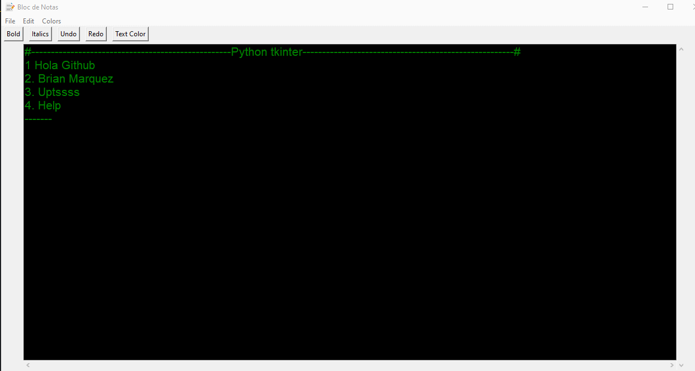
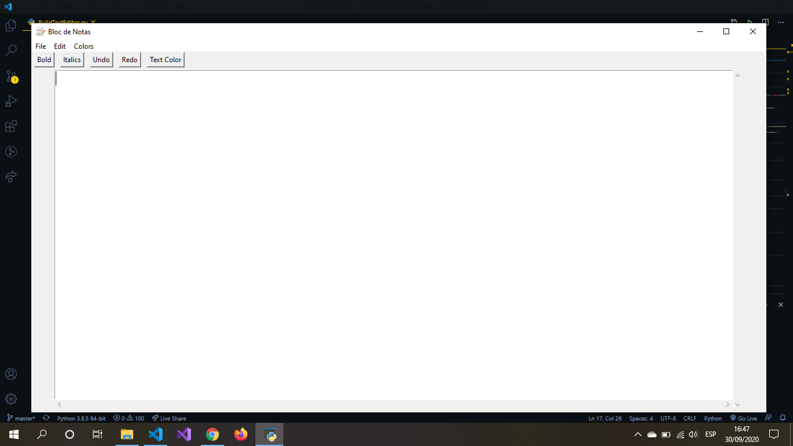
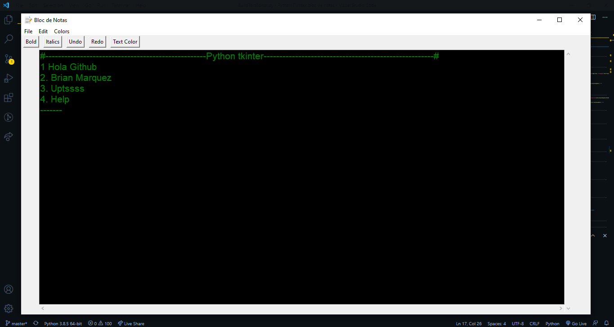

<h2 align="center">Bloc de Notas In Python Tkinter &nbsp; 📝 &nbsp;</h2>

  
  
  
    

La Aplicación tiene las básicas herramientas de un editor de texto como: abrir, cerra, copiar pegar, etc. A si mismo se puede usar como un básico editor de código, teniendo posibilidad de cambiar el color de la fuente y el color de fondo.

